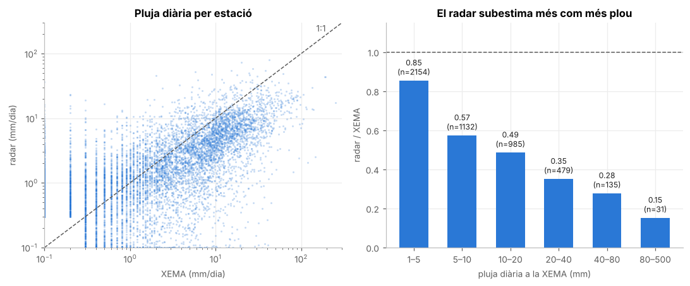
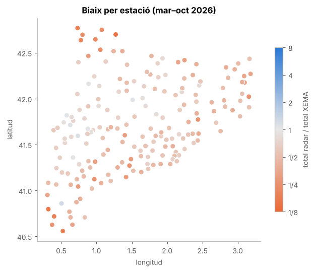
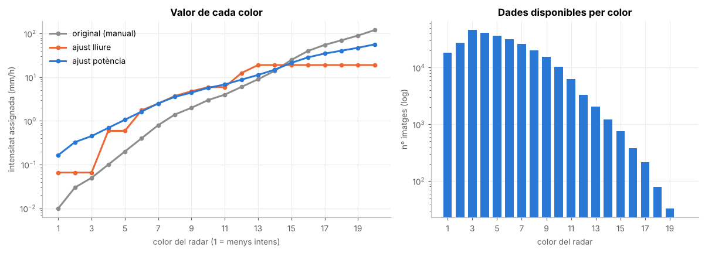
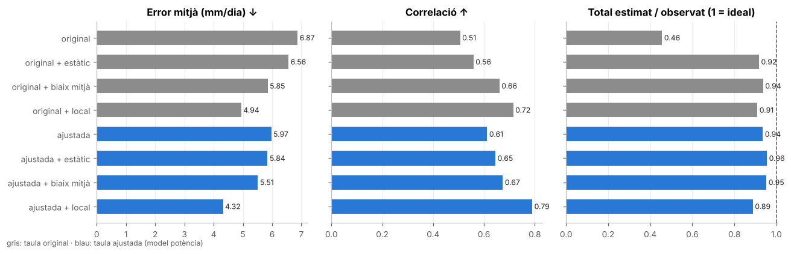
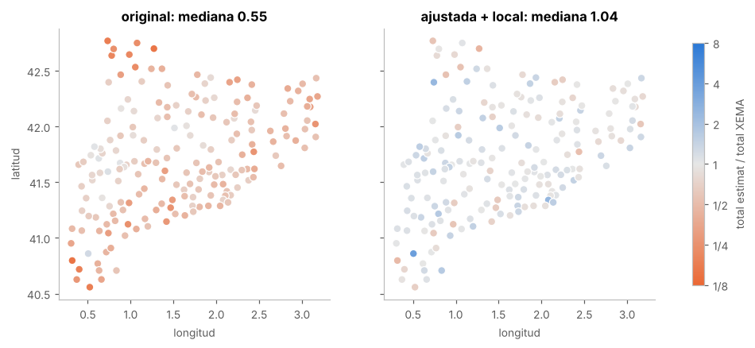

# Anàlisi i calibració del radar amb les estacions XEMA

Aquesta carpeta documenta com s'ha avaluat i millorat l'estimació de pluja de PlujaCat, que converteix els colors de les imatges del radar del Meteocat en mm. Tot el procés és reproduïble i es pot seguir als notebooks. GitHub els mostra amb els gràfics i les taules sense haver d'executar res.

| Notebook | Pregunta |
|---|---|
| [`01_diagnosi.ipynb`](01_diagnosi.ipynb) | Quin error té el producte actual? Les dades XEMA són fiables i comparables? |
| [`02_ajust_taula_colors.ipynb`](02_ajust_taula_colors.ipynb) | Quin valor (mm/h) hauria de tenir cada color del radar? |
| [`03_correccio_estacions.ipynb`](03_correccio_estacions.ipynb) | Quant millora si corregim el radar amb les estacions de cada dia? |

**Dades:** del 5 de març al 2 d'octubre de 2026, 187 estacions XEMA, unes 39.000 parelles estació-dia, de les quals unes 5.000 tenen pluja (≥1 mm). Les dades surten del mateix pipeline (`validacio/`) i de l'historial de git (`eines/`).

**Validació:** totes les mètriques són *fora de mostra*. Cada estació s'avalua amb una taula ajustada sense ella (validació creuada per estacions) i es corregeix només amb les estacions veïnes (*leave-one-out*). És a dir, representen l'error esperat en un punt del mapa on no hi ha estació.

## Resultats principals

**1. El producte actual subestima la pluja a la meitat**, i més com més plou. El dia de la XEMA (00–24 UTC) coincideix amb el del radar, i la qualitat de les estacions és bona: només 16 estació-dies sospitosos d'unes 39.000.



**2. El biaix canvia molt segons el lloc.** El radar subestima més al Pirineu i a les Terres de l'Ebre.



**3. La taula de colors ajustada** segueix el model $v = 2{,}88 \cdot v_{original}^{0{,}62}$, l'equivalent a reajustar la relació Z-R. Corregeix gairebé tot el biaix global, però no el biaix espacial.



**4. Corregir amb les estacions del mateix dia és el que més millora**, sobretot combinat amb la taula ajustada:

| Mètode | Total estimat / observat | Correlació | Error mitjà (mm/dia) | Mesos per estació dins de ±25% |
|---|---|---|---|---|
| Actual (taula manual) | 0,46 | 0,51 | 6,9 | 19% |
| Taula ajustada | 0,94 | 0,61 | 6,0 | 32% |
| **Taula ajustada + correcció local diària** | **0,89** | **0,79** | **4,3** | **52%** |





## Aplicació al pipeline

Des del 3 d'octubre de 2026, els acumulats diaris es calculen així (`calibracio_radar.py`, paràmetres a [`config_calibracio.json`](../config_calibracio.json)):

1. Cada imatge de 6 min es converteix amb la taula ajustada. Els fitxers de `dades_radar/` continuen guardant els valors originals, així que es pot recalibrar en el futur.
2. L'acumulat es normalitza per les imatges descarregades (240/dia).
3. Es corregeix amb les estacions XEMA del mateix dia. La correcció és local, en un radi de 30 km, i el biaix mitjà del dia hi entra com una estació més. Així, lluny de les estacions, la correcció passa de manera contínua al biaix mitjà, sense "cercles" al mapa (variant validada al final del notebook 03).
4. Els setmanals i mensuals sumen aquests diaris corregits.

Si les estacions d'un dia encara no estan disponibles, el diari es desa amb la taula ajustada però sense corregir (`correccio = pendent`). La correcció s'aplica automàticament en una execució posterior.

Cada NetCDF diari conté tres variables: `precipitacio_acumulada` (el producte final), `precipitacio_radar` (només la taula ajustada) i `precipitacio_original` (la taula manual antiga). Les parelles de validació (`validacio/parelles`) es calculen sempre amb `precipitacio_original`, perquè no depenguin de la calibració.

Els diaris des de l'1 d'agost s'han reprocessat amb la calibració (`eines/reprocessar_diaris.py`), i els setmanals i mensuals d'agost i setembre es regeneren a partir d'aquests diaris. Els setmanals i mensuals anteriors (de febrer a juliol) continuen amb el mètode antic.

**Limitacions:**
- Una correcció multiplicativa no pot crear pluja on el radar marca 0.
- La taula ajustada augmenta lleugerament les falses alarmes, del 1% al 3–5% dels dies secs.
- Queda una subestimació global d'un 10%.
- Pas pendent: validar amb una xarxa independent (AEMET).

## Reproduir l'anàlisi

```bash
pip install -r analisi/requirements-analisi.txt
cd analisi && jupyter nbconvert --to notebook --execute --inplace 0*.ipynb
```

`calibracio.py` conté les funcions compartides (càrrega de dades, mètriques, ajust de la taula i correccions). La versió operativa (només numpy) és `calibracio_radar.py`, a l'arrel del repo.
